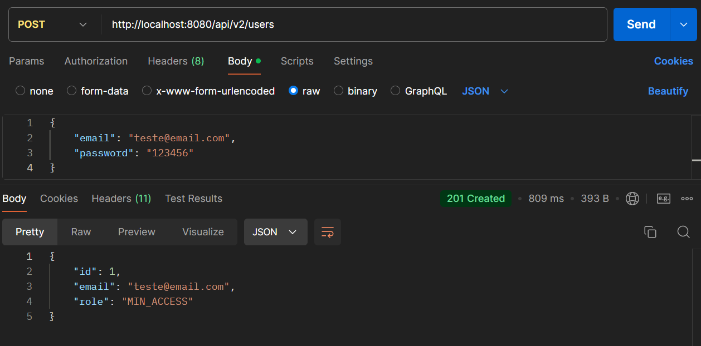
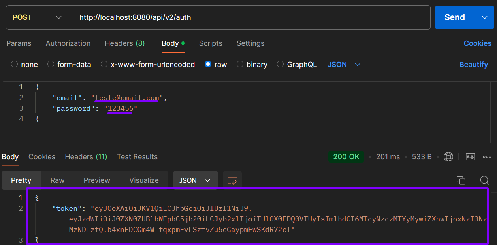
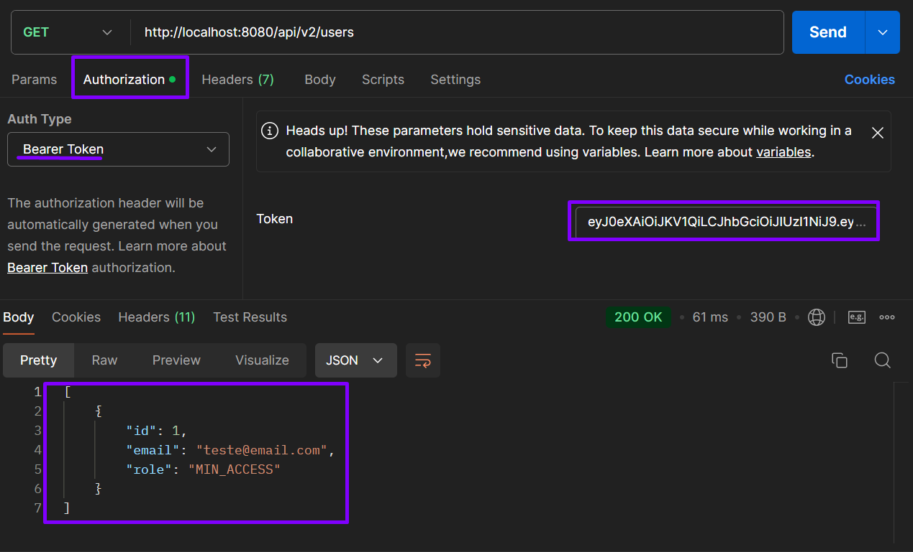
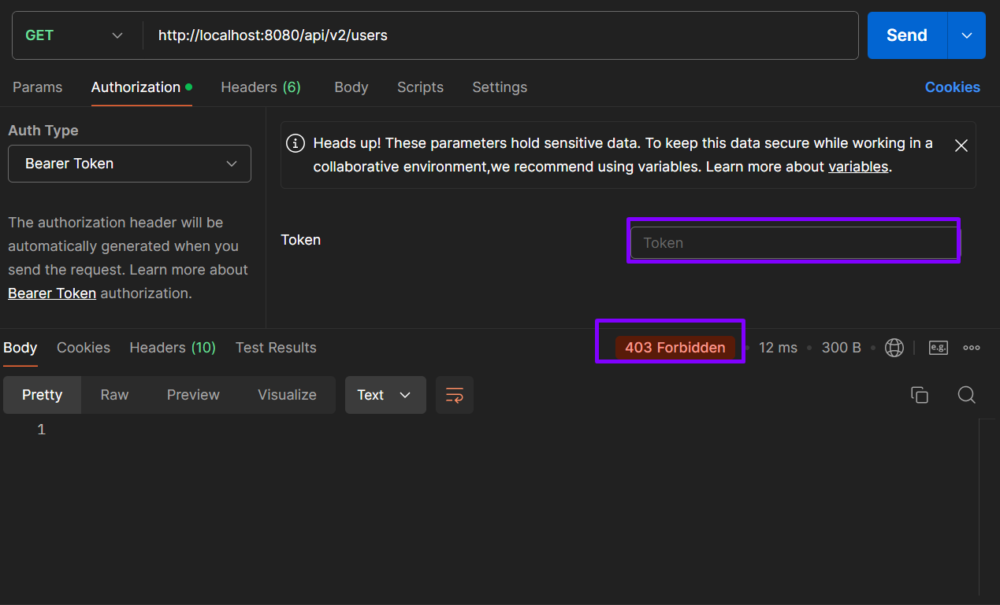

# api-autenticacao-usuarios 🔒

Este repositório foi criado com finalidade de exercitar meus conhecimentos sobre autenticação básica utilizando a biblioteca [jjwt](https://github.com/jwtk/jjwt).

A aplicação permite o gerenciamento de usuários, incluindo criação, atualização, exclusão e autenticação.

## Tecnologias Utilizadas ⚙️
- [**Java**](https://www.java.com/pt-BR/)
- [**Spring Boot**](https://spring.io/projects/spring-boot/)
- [**jjwt**](https://github.com/jwtk/jjwt)
- [**Hibernate**](https://hibernate.org/)
- [**MySQL**](https://dev.mysql.com/downloads/mysql/)
- [**Springdoc-openapi**](https://springdoc.org/)
- [**IntelliJ IDEA**](https://www.jetbrains.com/idea/)

## Instalação 🚀

Para rodar a aplicação localmente, siga os passos abaixo:

1. Clone o repositório:
   ```bash
   git clone https://github.com/lucas-h-lopes/api-autenticacao-usuarios.git
2. Navegue até o diretório do projeto:
   ```bash
   cd api-autenticacao-usuarios
3. Execute a aplicação:
   ```bash
   mvn spring-boot:run

## Documentação da API 📄

A documentação dos endpoints está disponível via Swagger. Após iniciar a aplicação, acesse a documentação em **{endereço local}/documentacao**.

## Testes 🪲

Para executar os testes, utilize o seguinte comando:
   ```bash
   mvn test
   ```

## Visualização do projeto 👀

<details>

<summary>Confira abaixo!</summary>

Criando um novo usuário:



Realizando a autenticação:



Após adicionar o token gerado na aba '**Authorization**' de algum recurso, o acesso é concedido:



Tentando acessar recurso sem informar um token:



</details>